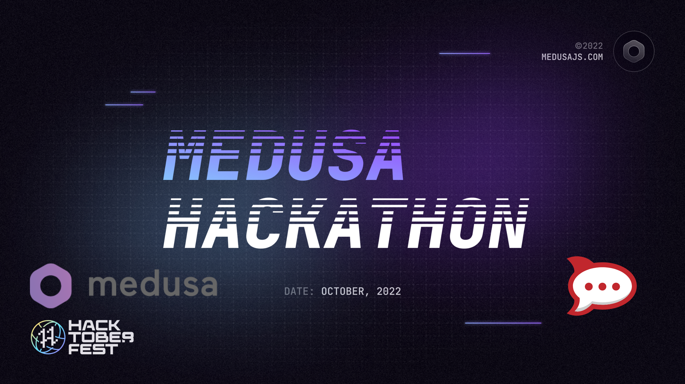

# Medusa Rocketchat Notification Plugin

This plugin integrates medusa and rocketchat together to open a way to receieve notifications from medusa on Rocketchat.



## Set up Project

### Prerequisites
- Medusa Backend/Frontend/admin Setup
- RocketChat Webhook


### Installation
- Clone this repo
- Configure below paramers in backend medsa-config.js file
```js
  {
    resolve: `rocket-chat-webhook-notifications`
    options:{
            webhook: `https://medusa-test.rocket.chat/hooks/../../`
            admin_orders_url: `http://localhost:7001/a/orders`
    }
  }

```
- add local package using [npm link](https://docs.medusajs.com/advanced/backend/plugins/create/#test-your-plugin) with backend repo
- setup REDIS_URL in projectConfig, For notification queue

## Resources
- https://docs.medusajs.com/usage/local-development/
- https://docs.medusajs.com/advanced/backend/plugins/create/
